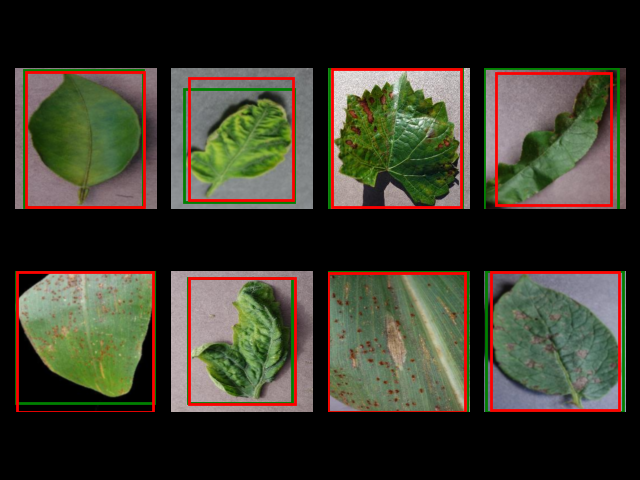

## Overview

The dataset used can be obtained from Kaggle (https://www.kaggle.com/datasets/sebastianpalaciob/plantvillage-for-object-detection-yolo/data), where the objective is to perform object detection on 38 
different species of plants. 

**Running the file and Info**

- To run the code, use the following command "python -m src.train_pipeline"
- At the bottom of the "train_pipeline" file you can modify the numbers to view different batch sizes

## Pipeline

- Preprocessing: Resizing (256x256), Gaussian Blur and Normalization 
- Basemodel: resnet50
- Batch size: 8
- Epochs: 100

**create_dataset.py**
- This file downloads the dataset from Kaggle and extracts the relevant contents
- The relevant contents are image path, labels (class_id) and bounding box (yolo annotation)
- This is saved into a json file for each image

**detection_dataset.py**
- Images are preprocessed and brought into a consistent format (i.e. tensors)
- This is then later used for dataloaders for image training and testing

**model.py**
- This defines the models being used for the respective predictions
- "regressor" is for the bounding box predictions
- "classifier" is for the class labels assigned to each leaf image

**train_pipeline.py**
- This is the general pipeline from splitting data into training and test (0.67/0.33)
- Then training the network and evaluating on test set
- Finally, displaying these labels, essentially ground truth vs predicted label 

## Result

The following set of images shows the following:
- ground truth label (green) 
- the model prediction (red)
- Each batch size is 8, where in total there are 63 batches, where the batch displayed below is batch 45

